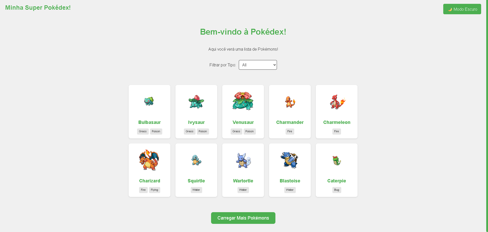
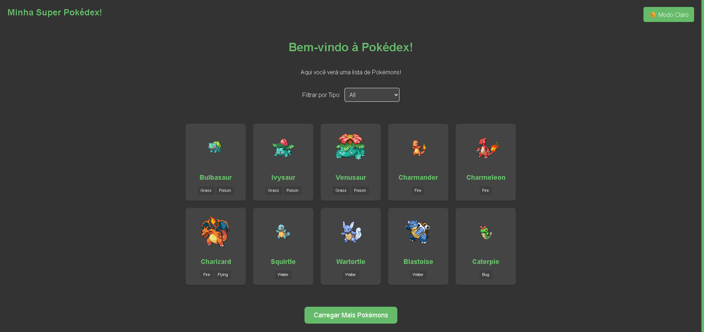
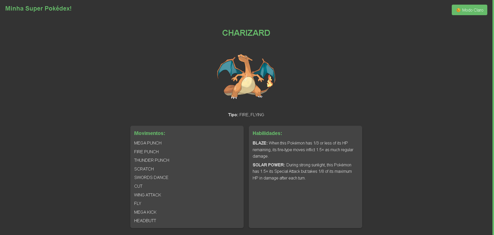
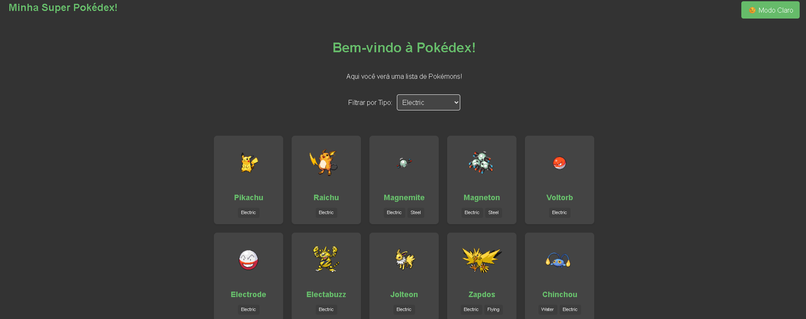

# 🌟 Pokédex Interativa com React

Este projeto é uma aplicação web interativa que funciona como uma Pokédex simples, permitindo aos usuários explorar uma lista de Pokémons, visualizar seus detalhes e alternar entre diferentes temas de interface. Desenvolvido como parte de um desafio técnico do curso DevQuest, o projeto demonstra o uso de React, consumo de API, gerenciamento de estado e estilização com Styled Components.

---

## ✨ Funcionalidades

A aplicação oferece as seguintes funcionalidades principais:

* **Listagem de Pokémons:** Exibe uma lista inicial de 10 Pokémons com suas imagens e nomes.
* **Carregar Mais:** Um botão "Carregar Mais Pokémons" permite ao usuário expandir a lista, adicionando 10 novos Pokémons a cada clique.
* **Detalhes do Pokémon:** Ao clicar em um Pokémon na lista, o usuário é redirecionado para uma página de detalhes que exibe:
    * Imagem oficial do Pokémon.
    * Nome.
    * Tipo(s).
    * Lista de movimentos (moves).
    * Lista de habilidades (abilities) com suas descrições.
* **Filtragem por Tipo (Bônus):** Um seletor permite filtrar a lista de Pokémons por tipo (ex: Fogo, Água, Grama), exibindo apenas os Pokémons do tipo selecionado. Quando um filtro é aplicado, o botão "Carregar Mais" é desativado, pois a API de tipo retorna todos os Pokémons daquele tipo de uma vez.
* **Alternância de Tema (Modo Claro/Escuro):** Um botão no cabeçalho permite alternar entre um tema claro e um tema escuro para a interface da aplicação, utilizando Context API e Styled Components para gerenciamento global de estilo.
* **Design Responsivo:** A interface se adapta a diferentes tamanhos de tela, proporcionando uma boa experiência em dispositivos móveis e desktops.

---

## 🛠️ Ferramentas Utilizadas

As seguintes tecnologias e bibliotecas foram escolhidas para o desenvolvimento deste projeto:

* **[React](https://react.dev/)**: Biblioteca JavaScript para construção de interfaces de usuário, escolhida por sua abordagem baseada em componentes, que facilita a modularização e reusabilidade do código.
* **[Vite](https://vitejs.dev/)**: Ferramenta de build rápida para desenvolvimento frontend. Foi escolhido por sua performance superior em desenvolvimento (Fast HMR) e facilidade de configuração em comparação com outras alternativas.
* **[React Router DOM](https://reactrouter.com/en/main)**: Biblioteca para roteamento declarativo em aplicações React, essencial para gerenciar a navegação entre a lista de Pokémons e a página de detalhes.
* **[Styled Components](https://styled-components.com/)**: Biblioteca para estilização de componentes React utilizando CSS-in-JS. Permite escrever CSS diretamente no JavaScript, oferecendo estilização baseada em props, temas dinâmicos e isolamento de estilos, tornando o código mais organizado e mantenível.
* **[Axios](https://axios-http.com/)**: Cliente HTTP baseado em Promises para fazer requisições a APIs. Escolhido pela sua simplicidade, robustez e bom tratamento de erros.
* **[PokeAPI](https://pokeapi.co/)**: A API pública utilizada para buscar todos os dados dos Pokémons.
* **[Jest](https://jestjs.io/)**: Framework de teste JavaScript para testes unitários.
* **[React Testing Library](https://testing-library.com/docs/react-testing-library/intro/)**: Conjunto de utilitários que permite testar componentes React de uma forma que se assemelha mais ao uso real pelo usuário, focando no comportamento e acessibilidade, em vez de detalhes de implementação.

---

## 💡 Decisões Técnicas

Durante o desenvolvimento, algumas decisões técnicas foram tomadas para otimizar a performance, a organização e a manutenibilidade do código:

1.  **Gerenciamento de Tema com `Context API` e `Styled Components`**:
    * **Motivação:** A funcionalidade de alternância de tema precisava ser acessível globalmente na aplicação (no `Header` para o botão, e em diversos componentes para aplicar os estilos).
    * **Implementação:** Utilizou-se a `Context API` do React (`ThemeContext`) para prover o estado do tema (`isDarkMode`, `toggleTheme`) e o objeto de tema (`theme` com cores e fundos) para todos os componentes aninhados. O `Styled Components` foi integrado para consumir este `theme` via `ThemeProvider` (`StyledThemeProvider`) e aplicar as variáveis de estilo dinamicamente aos componentes. Isso garante que a UI seja re-renderizada automaticamente com os novos estilos do tema ao ser alterado.
    * **Vantagem:** Evita "prop drilling" (passar props de tema manualmente por muitas camadas de componentes), mantendo o código mais limpo e fácil de escalar.

2.  **Separação de Lógica de Tema (`AppThemingWrapper.jsx`)**:
    * **Motivação:** Isolar a lógica de aplicação do tema global e do `GlobalStyle` do componente `App.jsx` principal.
    * **Implementação:** Um componente `AppThemingWrapper` foi criado para encapsular `StyledThemeProvider` e `GlobalStyle`, que por sua vez renderiza o `App`.
    * **Vantagem:** Mantém o `App.jsx` mais limpo e focado em suas rotas e estrutura principal, e centraliza a configuração do tema em um único local lógico.

3.  **Carregamento de Dados da API (`Home.jsx` e `PokemonDetail.jsx`)**:
    * **Motivação:** Obter dados de Pokémons de forma eficiente e gerenciar estados de carregamento e erro.
    * **Implementação:** `useState` para gerenciar a lista de Pokémons, a URL da próxima página (`nextUrl`), e estados de `loading` e `error`. `useEffect` é usado para disparar a busca inicial e a cada mudança de tipo de filtro. `axios` foi utilizado para as requisições HTTP.
    * **Otimização:** No `Home.jsx`, a função `fetchPokemons` foi envolvida em `useCallback` para otimizar o desempenho, evitando que a função seja recriada em cada re-renderização desnecessariamente, o que poderia causar loops infinitos no `useEffect`.

4.  **Tratamento de Dados de Habilidades (`PokemonDetail.jsx`)**:
    * **Motivação:** A PokeAPI retorna apenas a URL da habilidade dentro dos detalhes do Pokémon, mas a descrição completa da habilidade precisa de uma segunda requisição.
    * **Implementação:** Dentro de `PokemonDetail`, após obter os dados do Pokémon, é feita uma nova Promise.all para buscar os detalhes de cada habilidade individualmente, e então a descrição é extraída e anexada aos dados do Pokémon antes de serem renderizados.
    * **Vantagem:** Garante que todas as informações necessárias estejam disponíveis para exibição.

5.  **Testes (Bônus - `Header.test.jsx`)**:
    * **Motivação:** Garantir a funcionalidade do componente `Header`, especialmente a alternância de tema.
    * **Implementação:** Utilização de `Jest` e `React Testing Library`. O componente `Header` é renderizado dentro do seu `ThemeProvider` real, simulando o ambiente de execução da aplicação. `fireEvent.click` é usado para simular interações do usuário, e `expect(...).toHaveTextContent` e `toBeInTheDocument` para verificar o estado e a presença de elementos.
    * **Decisão:** Optou-se por focar no teste do `Header` como o "desafio bônus" de testes, pois ele demonstra o entendimento do ecossistema de testes para componentes React que interagem com a Context API, que é uma funcionalidade chave do projeto. Testar componentes com chamadas de API como `Home` e `PokemonDetail` exigiria uma configuração adicional (como Mock Service Worker - MSW) para mockar as requisições de rede, o que adicionaria uma complexidade não solicitada diretamente no bônus e consumiria mais tempo do desafio.

---

## 🚀 Como Rodar o Projeto

Para rodar este projeto em seu ambiente local, siga os passos abaixo:

1.  **Clone o repositório:**
    ```bash
    git clone https://github.com/cassio-leite/pokedex-app
    cd pokedex-app
    ```

2.  **Instale as dependências:**
    ```bash
    npm install
    # ou
    yarn install
    ```

3.  **Inicie o servidor de desenvolvimento:**
    ```bash
    npm run dev
    # ou
    yarn dev
    ```
    O projeto será iniciado em `http://localhost:5173` (ou outra porta disponível). Abra essa URL no seu navegador.

4.  **Para rodar os testes:**
    ```bash
    npm test
    # ou
    yarn test
    ```
    Isso executará o teste do componente `Header` e exibirá o resultado no terminal.

---

## 📸 Screenshots da Aplicação

*(Aqui você pode adicionar as imagens que você tem do projeto rodando, por exemplo:)*

**Modo Claro:**


**Modo Escuro:**


**Página de Detalhes do Pokémon:**


**Filtragem por Tipo:**


---

Agradeço a oportunidade de participar deste desafio!